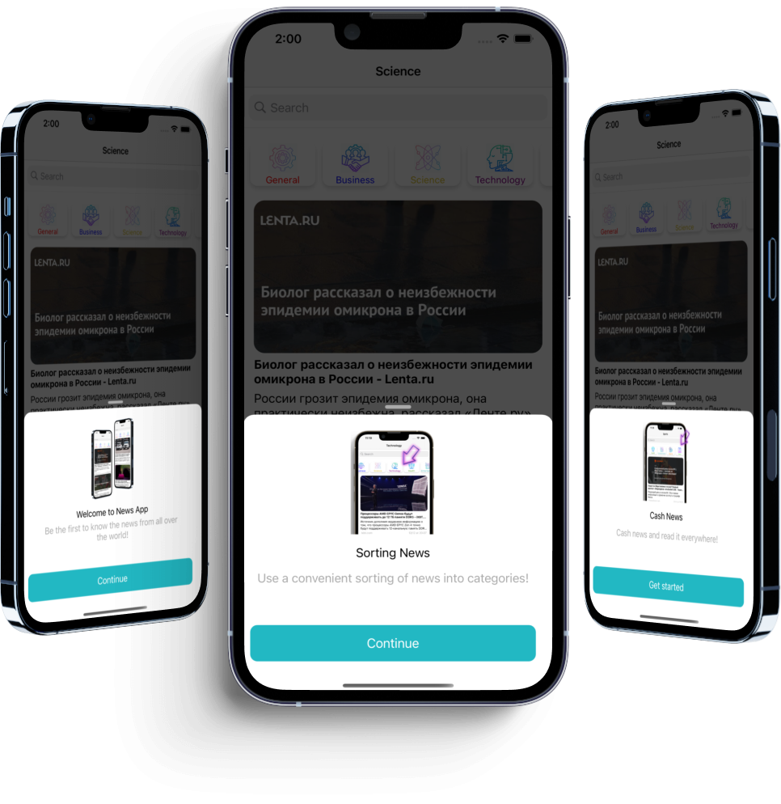

# NewsApplication

## Introduction

Hi, my name is Aleksandr. I'm glad to see you on my [GitHub](https://github.com/AleksandrBasov?tab=repositories).

## Features

The application is developed in Swift language. I used MVVM architecture in my project.

<h1 align="center">

</h1>

In this application, I used the PanModal framework for beautiful Onboarding.

<h1 align="center">

</h1>

SearchBar, CollectionView and TableView are located on the main screen. CollectionView is intended for sorting news into categories, TableView for displaying news.

<h1 align="center">

</h1>

I also used the Realm framework to save news so that they could be read without the Internet.

<h1 align="center">

</h1>

Clicking on a cell in the TableView will take you to Safari. Have a nice day and enjoy my application.

<h1 align="center">

</h1>
